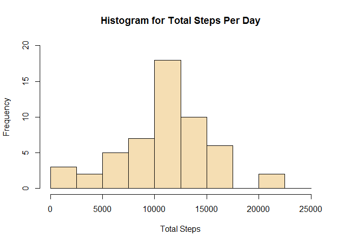
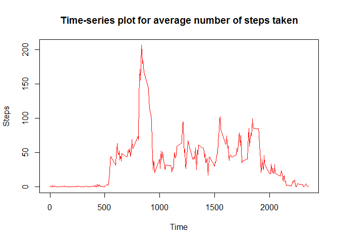
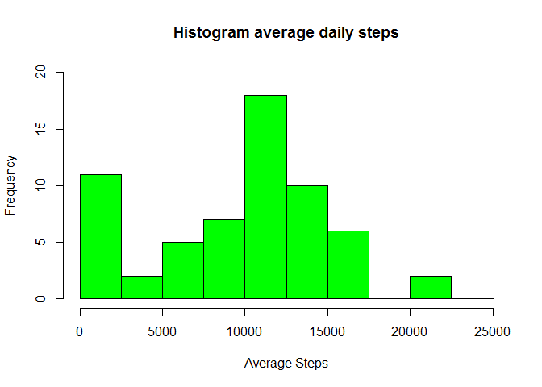
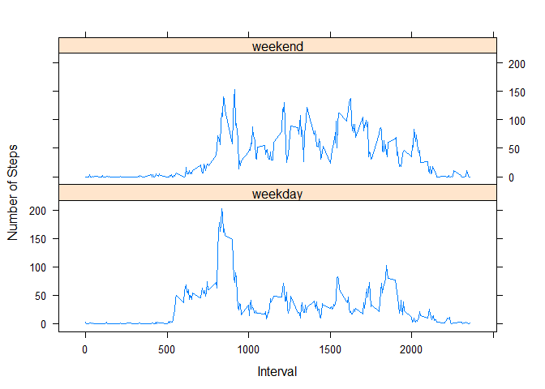

# Reproducible Research: Peer Assessment 1


## Loading and preprocessing the data

```r
if(!file.exists("data")){
        dir.create("data")
}
fileUrl <-"https://d396qusza40orc.cloudfront.net/repdata%2Fdata%2Factivity.zip"
download.file(fileUrl, destfile = "./data/activity.zip")
unzip(zipfile = "./data/activity.zip",exdir = "./data")

activityData <- read.csv("./data/activity.csv", header = TRUE)
head(activityData)
```

```
##   steps       date interval
## 1    NA 2012-10-01        0
## 2    NA 2012-10-01        5
## 3    NA 2012-10-01       10
## 4    NA 2012-10-01       15
## 5    NA 2012-10-01       20
## 6    NA 2012-10-01       25
```

```r
library(lattice)
# Date format will be changed when calculating activity patterns between weekdays and weekends
```


## What is mean total number of steps taken per day?
####1. Calculate the total number of steps taken per day


```r
#Using the aggregate function to get the sums of the steps by dates (each date represent a day)
totalSteps <- aggregate(. ~ date, activityData, sum, na.rm=TRUE)
```

####2. Histogram


```r
hist(totalSteps[,2], breaks=seq(from=0, to=25000, by=2500), ylim = c(0,20),
     main = "Histogram for Total Steps Per Day", xlab = "Total Steps", col = "wheat")
```

<!-- -->

####3. Mean and Median


```r
mean(totalSteps[,2])
```

```
## [1] 10766.19
```

```r
median(totalSteps[,2])
```

```
## [1] 10765
```


## What is the average daily activity pattern?

####1. Time Series Plot


```r
averageSteps <- aggregate(. ~ interval, activityData, mean, na.rm=TRUE)
plot(averageSteps$interval,averageSteps$steps, type = "l", col="red", xlab = "Time", ylab = "Steps",
     main = "Time-series plot for average number of steps taken")
```

<!-- -->

####2. Maximum number of steps


```r
which.max(averageSteps$steps)
```

```
## [1] 104
```

```r
maxStep <- which.max(averageSteps$steps)
averageSteps[maxStep,c(1:2)]
```

```
##     interval    steps
## 104      835 206.1698
```


## Imputing missing values

####1. Number of Missing values in dataset


```r
sum(is.na(activityData[,1]))
```

```
## [1] 2304
```

####2. Devise a strategy for filling in all of the missing values in the dataset


```r
# Finding the total steps taken for each day
avgDailySteps <- aggregate(. ~ date, activityData, mean, na.rm=TRUE)
#data set was data
mean_imputed <- transform(activityData, steps = ifelse(is.na(activityData$steps), avgDailySteps$steps[match(activityData$interval, avgDailySteps$interval)], activityData$steps))
# for the areas in "mean_imputed" with NAs, replace those with 0. This means nothing was recorded for those days
mean_imputed[is.na(mean_imputed)] <- 0
```

####3. Create a new dataset that is equal to the original dataset but with the missing data filled in


```r
# New data set
head(mean_imputed)
```

```
##   steps       date interval
## 1     0 2012-10-01        0
## 2     0 2012-10-01        5
## 3     0 2012-10-01       10
## 4     0 2012-10-01       15
## 5     0 2012-10-01       20
## 6     0 2012-10-01       25
```

```r
dim(mean_imputed)
```

```
## [1] 17568     3
```

####4. Make a histogram of the total number of steps taken each day and Calculate and report the mean and median total number of steps taken per day


```r
#Calculating the avearge daily steps (assuming each date is a day)
total_mean_imputed <- aggregate(. ~ date, mean_imputed, sum)
#Histogram
hist(total_mean_imputed$steps, breaks=seq(from=0, to=25000, by=2500), ylim = c(0,20), main = "Histogram average daily steps", xlab = "Average Steps", col = "green")
```

<!-- -->


```r
#mean and median
mean(total_mean_imputed$steps)
```

```
## [1] 9354.23
```

```r
median(total_mean_imputed$steps)
```

```
## [1] 10395
```


```r
#Differences
(meanDifference <- mean(totalSteps[,2]) - mean(total_mean_imputed$steps))
```

```
## [1] 1411.959
```

```r
(medianDifference <- median(totalSteps[,2]) - median(total_mean_imputed$steps))
```

```
## [1] 370
```

The values differ from the estimates from the first part of the assignment. The frequncy of the lower lower average steps increased when the missing data was imputed.

## Are there differences in activity patterns between weekdays and weekends?

####1. Create a new factor variable in the dataset with two levels - "weekday" and "weekend" indicating whether a given date is a weekday or weekend day.


```r
#Changing the date format
mean_imputed$date <- strptime(as.character(mean_imputed$date), "%Y-%m-%d")
# obtaining day of the week from strptime
day <- weekdays(mean_imputed$date)
# add day to the dataframe
mean_imputed <- data.frame(mean_imputed,day)
# coding day as weekend or weekday
Weekend <- c("Saturday", "Sunday")
dayType <- ifelse(mean_imputed$day %in% Weekend, "weekend", "weekday")
# Add day of the week to the data
mean_imputed <- data.frame(mean_imputed, dayType)
head (mean_imputed)
```

```
##   steps       date interval    day dayType
## 1     0 2012-10-01        0 Monday weekday
## 2     0 2012-10-01        5 Monday weekday
## 3     0 2012-10-01       10 Monday weekday
## 4     0 2012-10-01       15 Monday weekday
## 5     0 2012-10-01       20 Monday weekday
## 6     0 2012-10-01       25 Monday weekday
```

####2. Make a panel plot containing a time series plot (i.e. type = "l") of the 5-minute interval (x-axis) and the average number of steps taken, averaged across all weekday days or weekend days (y-axis)


```r
panelAvgPlot <- aggregate(. ~ interval + dayType, mean_imputed[,c(1,3,5)], mean)
xyplot(steps ~ interval | dayType, panelAvgPlot, type="l", xlab = "Interval", ylab = "Number of Steps", layout = c(1,2))
```

<!-- -->

